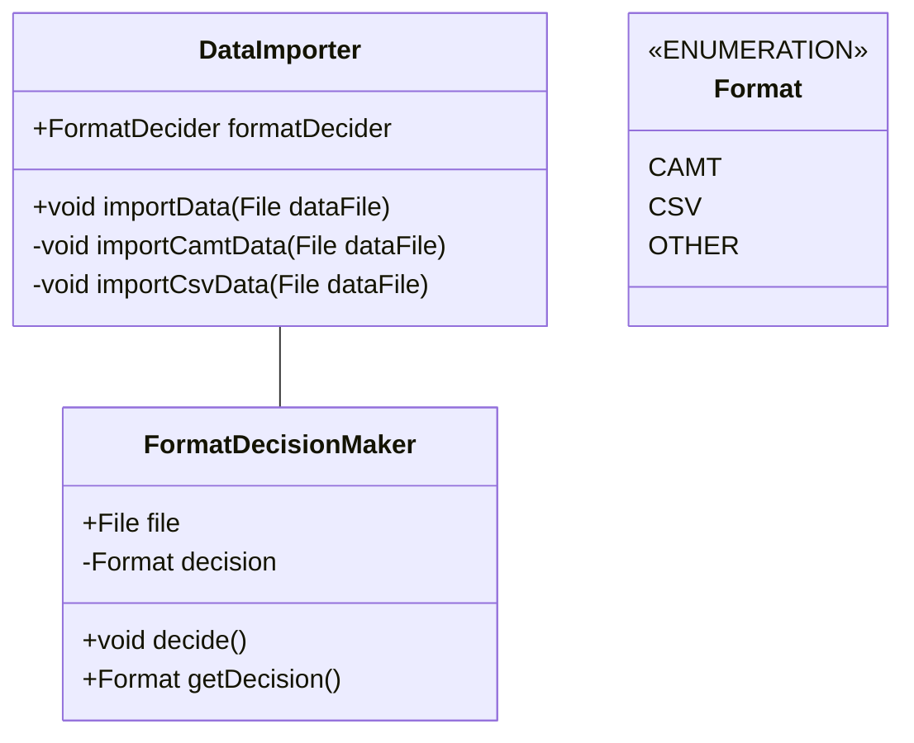

# Architecture

## Data importer

Use a single interface-like class (the exact is pattern still to be chosen) that imports the data. 
It should expose a method that can be fed any file and will decide on itself which exact implementation will be used to import the data as long as the format of the file is supported (CAMT).
The goal is to make it very easy to add more importable file formats in the future.

### Specific data requirements
- Parse all data to a uniform format
- Extract the bank account which this data belongs to

### Implementation

### Misc

Depending on the imported source format, I have to differentiate between adding data to an existing `FinanceTimeSeries` and `BankAccount` or creating a new one. E.g. the CAMT format stipulates that each imported XML will translate to one `FinanceEntry` (my data format), i.e. one day worth of finance- and transaction-information. 
The CSV that is exported by ING however basically has the whole time series in one file. 
Therefore, the `importData()` method will have to persists a `FinanceTimeSeries` object and all its attached object.