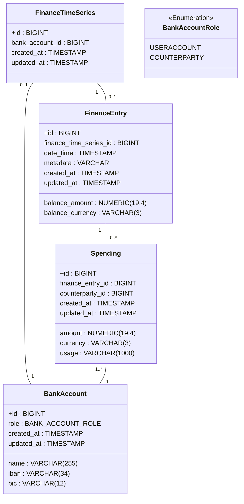

# Data models

## Database model

```mermaid
classDiagram
    
    FinanceTimeSeries "0..1" -- "1" BankAccount
    FinanceTimeSeries "1" -- "0..*" FinanceEntry
    FinanceEntry "1" -- "0..*" Spending    
    Spending "1..*" -- "1" BankAccount
    
    class FinanceTimeSeries{
        +id : BIGINT
        bank_account_id : BIGINT
        created_at : TIMESTAMP
        updated_at : TIMESTAMP
    }
    class FinanceEntry{
        +id : BIGINT
        finance_time_series_id : BIGINT
        date_time : TIMESTAMP
        balance_amount : NUMERIC(19,4)
        balance_currency : VARCHAR(3)
        metadata : VARCHAR
        created_at : TIMESTAMP
        updated_at : TIMESTAMP
    }
    class BankAccount{
        +id : BIGINT
        name : VARCHAR(255)
        iban : VARCHAR(34)
        bic : VARCHAR(12)
        role : BANK_ACCOUNT_ROLE
        created_at : TIMESTAMP
        updated_at : TIMESTAMP
    }
    class Spending{
        +id : BIGINT
        finance_entry_id : BIGINT
        amount : NUMERIC(19,4)
        currency : VARCHAR(3)
        usage : VARCHAR(1000)
        counterparty_id : BIGINT
        created_at : TIMESTAMP
        updated_at : TIMESTAMP
    }
    class BankAccountRole{
        <<Enumeration>>
        USERACCOUNT
        COUNTERPARTY
    }
```