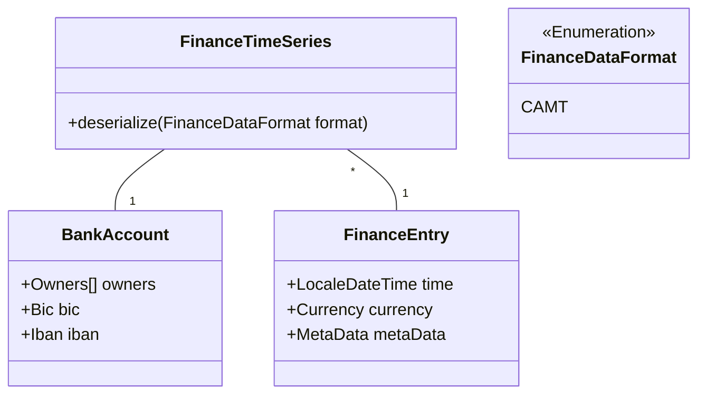

# Data models

## Finance time series model

```mermaid
classDiagram
    
    FinanceTimeSeries "*" -- "1" BankAccount
    FinanceTimeSeries "*" -- "1" FinanceEntry

    class FinanceTimeSeries{
        +deserialize(FinanceDataFormat format)
    }
    class FinanceEntry{
        +LocaleDateTime time
        +Currency currency
        +MetaData metaData
    }
    class BankAccount{
        +Owners[] owners
        +Bic bic
        +Iban iban
    }
    class FinanceDataFormat {
        <<Enumeration>>
        CAMT
    }
```
